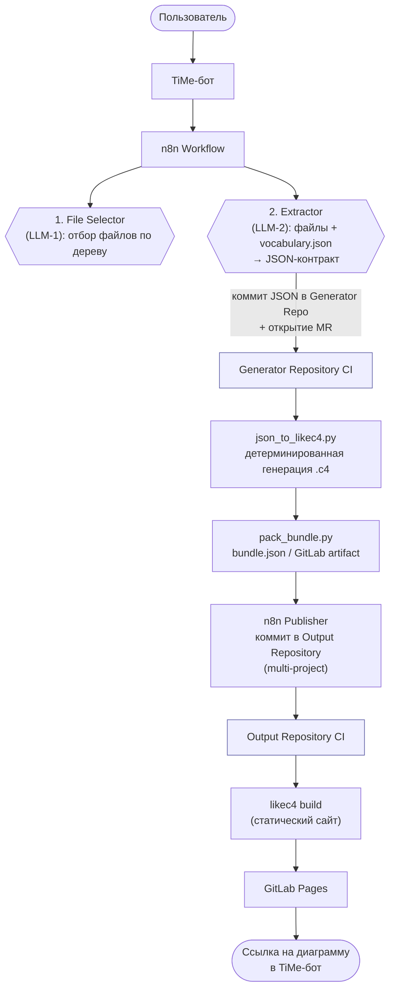

# [archmap] Сервис автоматизированной генерации архитектурной документации (LikeC4) из репозитория

> **Архитектурная документация, которая рисуется из кода и не устаревает.**  
> `archmap` читает репозиторий, разбирается, из чего состоит система и с чем она связана, и строит C4-диаграммы сам. Без ручной отрисовки, без «протухших» схем, в едином стандарте для всего направления.

---

## Содержание
1. [Бизнес-ценность и проблематика](#1-бизнес-ценность-и-проблематика)
   - [Проблема](#проблема)
   - [Решение](#решение)
   - [Что это даёт ролям](#что-это-даёт-ролям)
   - [Сравнение «Было и стало»](#сравнение-было-и-стало)
2. [Как устроен сервис (Архитектура и пайплайн)](#2-как-устроен-сервис-архитектура-и-пайплайн)
   - [Общая схема конвейера](#общая-схема-конвейера)
   - [Пошаговый процесс работы конвейера](#пошаговый-процесс-работы-конвейера)
3. [Глоссарий и основные концепции](#3-глоссарий-и-основные-концепции)
   - [Основные сущности](#основные-сущности)
   - [Артефакты](#артефакты)
   - [Процессы](#процессы)
   - [Операции над данными](#операции-над-данными)
   - [Атрибуты и параметры](#атрибуты-и-параметры)
4. [Ключевые возможности](#4-ключевые-возможности)
5. [Руководство пользователя (Гайд по запуску)](#5-руководство-пользователя-гайд-по-запуску)
   - [Пошаговый запуск](#пошаговый-запуск)
   - [Глубина анализа (Extraction Level)](#глубина-анализа-extraction-level)
6. [Ограничения и особенности работы](#6-ограничения-и-особенности-работы)
7. [Часто задаваемые вопросы (FAQ)](#7-часто-задаваемые-вопросы-faq)
8. [Дорожная карта MVP и статус продукта](#8-дорожная-карта-mvp-и-статус-продукта)
   - [Вехи развития](#вехи-развития)
9. [Роль в Archon](#9-роль-в-archon)

---

## 1. Бизнес-ценность и проблематика

### Проблема
Архитектурная документация нужна всем, но в актуальном виде её почти ни у кого нет:
* **Рисовать долго и дорого:** Ручная C4-схема продукта занимает 1–3 дня работы (разобраться в коде, выделить контейнеры, компоненты, связи, аккуратно расставить). Архитектор становится «узким горлышком».
* **Схема быстро устаревает («врёт»):** Через неделю код уходит вперёд, через месяц схеме никто не верит и ей перестают пользоваться. Дни работы уходят в мусор, а поддерживать руками дороже, чем перерисовать заново.
* **Зоопарк инструментов:** Команды используют разные инструменты (draw.io, Miro, хранят в голове), разные нотации и детализацию. Общей картины по направлению нет.
* **Долгий онбординг новичков:** Новый сотрудник тратит недели на сбор картины по крупицам через сеньоров и чтение кода вместо пары часов на общее понимание.

### Решение
`archmap` полностью автоматизирует процесс: пользователь передаёт ссылку на репозиторий, а сервис сам анализирует код и документацию, извлекает архитектуру и публикует C4-диаграммы, доступные по ссылке в браузере.

**Что получается на выходе:**
* **Диаграммы уровней C1, C2, C3:** от общего контекста до внутренних компонентов.
* **Динамические диаграммы бизнес-потоков (flows):** пошаговые сценарии выполнения процессов (например, регистрация креатива в ОРД).
* **Сводная landscape-карта направления:** все продукты на одном полотне, общие внешние системы вынесены без дублирования.
* **Единый стандарт:** общая нотация, стили и словарь тегов для всех продуктов и команд.
* **Мгновенная актуализация:** при изменении кода достаточно перезапустить процесс.

### Что это даёт ролям
* **Архитектору:** Освобождение от роли «узкого горлышка» и рутинного перетаскивания прямоугольников. Работа идёт с готовой моделью (проверка спорных мест, принятие решений).
* **Лиду (Team/Tech Lead):** Живая картина по всему направлению в одном месте. Ускорение онбординга новичков в разы. Единый стандарт без ручного контроля.
* **Аналитику:** Наглядные бизнес-потоки без необходимости вычитывать логику из исходного кода.

### Сравнение «Было и стало»

| Задача | Раньше | С archmap |
| :--- | :--- | :--- |
| **Первая диаграмма продукта (C1–C3)** | 1–3 дня ручной работы | 10–15 минут |
| **Актуализация после изменений в коде** | Полдня, а чаще — никогда | Перезапуск, те же 10–15 минут |
| **Сводная карта направления** | Недели согласований между командами | Собирается автоматически |
| **Единый стиль и нотация между командами** | Практически недостижимо | Из коробки |
| **Онбординг нового человека в архитектуру** | Недели, с отвлечением сеньоров | Часы, самостоятельно по ссылке |

*(Оценки времени ориентировочные, на основе типичной практики ручной отрисовки).*

---

## 2. Как устроен сервис (Архитектура и пайплайн)

### Общая схема конвейера
`archmap` использует связку **языковых моделей (LLM)** для извлечения архитектуры из кода и **детерминированного генератора** для сборки LikeC4-моделей.  
Оркестрация конвейера выполняется в **n8n**.

Единый центр: **Generator Repository** `ded-aa-lab/archmap` (включает код генератора `/tool` и CI-шаблоны сборки).



### Пошаговый процесс работы конвейера

1. **Запуск и сбор параметров (TiMe-бот `@archmap`):**
   * Пользователь пишет боту команду `старт` и заполняет форму в треде:
     * Ссылка на **Source Repository**;
     * Глубина анализа (`extraction_level`);
     * Целевой **Output Repository**;
     * Опциональный комментарий.
   * При первом запуске запрашивается и сохраняется GitLab Personal Access Token пользователя (в n8n Data Table).

2. **Извлечение (LLM-парсер, 2 модели):**
   * **File Selector (LLM-1):** Анализирует дерево файлов репозитория (без чтения содержимого), отсекает тесты, vendor, сгенерированный код и бинарники. Раскладывает релевантные файлы по категориям: `product`, `containers`, `components`, `external_systems`, `flows`.
   * **Extractor (LLM-2):** Читает отобранные файлы вместе со словарём тегов (`vocabulary.json`) и формирует структурированный JSON-контракт: продукт, контейнеры, компоненты, внешние системы, связи, потоки (`flows`) и сомнительные места (`uncertainties`).
   * **n8n** коммитит JSON в `inputs/<repo>_<extraction_level>.json` репозитория генератора и открывает MR.

3. **Генерация (JSON → C4, CI генератора):**
   * MR-ивент запускает джобу `generate-c4`:
     * Скрипт `json_to_likec4.py` преобразует JSON в `.c4`-файлы, строит статические view (C1/C2/C3) и динамические view для flows, валидирует теги и ставит маркеры `#manual_check` на неопределённости.
     * Ссылается на канонические ID общих внешних систем из `shared/externals.c4` (без дублирования).
     * Скрипт `pack_bundle.py` упаковывает папку `c4/` в `bundle.json` (публикуется как GitLab artifact).

4. **Публикация (n8n Publisher):**
   * n8n скачивает `bundle.json` и коммитит файлы в целевой **Output Repository** в формате multi-project:
     ```text
     docs/c4/
     ├── architecture-map/        ← LikeC4-проект
     │   ├── likec4.config.json
     │   └── architecture-map.c4
     ├── audience-machine/        ← LikeC4-проект
     ├── ord/                     ← LikeC4-проект
     ├── auditor/                 ← LikeC4-проект
     └── landscape.c4             ← глобальная landscape-схема
     ```
   * Открывается MR с автоматическим слиянием (auto-merge) в ветку `master`.

5. **Сборка и деплой (Output Repo CI):**
   * Output Repo подключает общий шаблон CI:
     ```yaml
     include:
       project: 'ded-aa-lab/archmap'
       file: '/ci/build-likec4.gitlab-ci.yml'
     ```
   * Джоба `build-likec4` выполняет `likec4 build --base "/${CI_PROJECT_NAME}/"` в `docs/c4` → статический сайт собирается в `public/`.
   * Джоба `pages` деплоит сайт на **GitLab Pages**.
   * Итоговая ссылка отправляется пользователю в тред TiMe.

---

## 3. Глоссарий и основные концепции

### Основные сущности
* **Source Repository (SRC):** Репозиторий с исходным кодом продукта, для которого генерируется архитектурная диаграмма (например, `ded-aa-liza/notification-go`).
* **Output Repository (OUT):** Целевой репозиторий, куда пушится готовый LikeC4-код и где собирается статический сайт с диаграммами (например, `ded-aa-lab/archmap-tmarketing`).
* **Landscape:** Самый верхний уровень представления, объединяющий все продукты направления (агрегат из всех Output Repositories, например, `archmap-landscape`).
* **Generator Repository:** Репозиторий с кодом генератора и шаблонами CI, общий на всё направление (`ded-aa-lab/archmap`).

### Артефакты
* **Bundle:** Zip-архив / JSON (`bundle.json`) с готовыми `.c4`-файлами, `likec4.config.json` и метаданными. Публикуется как GitLab artifact.
* **Diagram (Диаграмма):** Конкретная визуализация одного view (C1, C2, C3, dynamic view) внутри LikeC4-проекта.
* **Project (LikeC4 Project):** Папка `docs/c4/<slug>/` в Output Repository с собственным `likec4.config.json` (один проект = одна диаграмма продукта).
* **Landscape Map (Карта направления):** Верхнеуровневая диаграмма C0, где продукты представлены как «чёрные ящики», а общие внешние сервисы вынесены в `shared`-элементы.

### Процессы
* **Extraction (Извлечение):** Анализ исходного репозитория с помощью LLM для извлечения сущностей, связей и потоков данных (в Generator Repository).
* **Generation (Генерация):** Детерминированное преобразование JSON-модели в LikeC4-код (`.c4` + `likec4.config.json`).
* **Publication (Публикация):** Выгрузка полученного Bundle через n8n в Output Repository через MR с авто-мерджем.
* **Build (Сборка):** Выполнение `likec4 build` в Output Repository CI для сборки статики в `public/`.
* **Deployment (Деплой):** Публикация собранного сайта на GitLab Pages.
* **Landscape Assembly (Сборка карты):** Агрегация всех Output Repositories в общую Landscape Map (триггерится в CI Landscape Repository после деплоя любого продукта).

### Операции над данными
* **Initial Extraction:** Первая выгрузка продукта с нуля (создание всех файлов `.c4`).
* **Refresh:** Полная перегенерация с перезаписью всех файлов при накоплении больших изменений в коде.
* **Incremental Sync:** Точечное обновление диаграммы на основе `git diff` при небольших изменениях.
* **Enrichment:** Обогащение существующей модели новым контекстом (ADR, манифесты K8s, спецификации API).
* **Manual Edit:** Ручные правки кода диаграмм в Output Repository через обычный Merge Request.

### Атрибуты и параметры
* **Extraction Level (Глубина анализа):** `context` / `context+container` / `full` (`context+container+component`).
* **Shared Service:** Сервис, разделяемый несколькими продуктами (Kafka, SSO, Users Service и др.). На Landscape Map выносится отдельно.
* **Product:** Продукт как «чёрный ящик» на Landscape Map (без внутренних деталей, только связи с Shared Services).

---

## 4. Ключевые возможности

1. **Полный C4-стек:** Статические уровни C1 (контекст + окружение), C2 (внутренние контейнеры) и C3 (компоненты: handler, usecase, repository, client). *USECASES строятся всегда.*
2. **Динамические представления (Business Flows):** Генерация пошаговых сценариев взаимодействия (dynamic views) для бизнес-процессов.
3. **Запуск из мессенджера:** Полное управление через бота в TiMe: передача параметров, отслеживание статусов выполнения, получение готовой ссылки без необходимости заходить в CI.
4. **Multi-project структура:** Изолированные проекты продуктов в папках `docs/c4/<slug>/` со ссылками через `import`. Сборка в общий `landscape.c4`.
5. **Дедупликация общих систем:** Централизованное объявление внешних и shared-систем в `shared/externals.c4` с каноническими ID исключает дубли и конфликты при слиянии схем.
6. **Гибкая глубина анализа:** Настройка уровня детализации под конкретные задачи (`context` → `context+container` → `full`).
7. **Единый Generator Repository:** Централизованное хранение скриптов генерации и подключаемого шаблона `build-likec4.gitlab-ci.yml`.
8. **Автоматическая диагностика качества:** Поиск битых ссылок, «висячих» элементов, связей `external → external`, отчёт в шапке `.c4` и подсветка сомнительных мест тегом `#manual_check`.
9. **Единый источник стандартов:** Общая нотация и словарь тегов (`specs.c4` + `vocabulary.json`) для всего пространства продуктов.

---

## 5. Руководство пользователя (Гайд по запуску)

### Пошаговый запуск

1. **Напишите боту:** Откройте диалог с `@archmap` в TiMe и отправьте команду `старт`. Бот создаст тред для процесса.
2. **Укажите GitLab токен (только при первом запуске):** Передайте Personal Access Token GitLab с правами `read_api` и `read_repository` (нужен для вычитывания исходного репозитория от вашего имени; сохраняется в защищённом хранилище).
3. **Заполните форму:**
   * **Репозиторий:** Ссылка на целевой Source Repository;
   * **Глубина анализа:** Выберите уровень детализации (C1, C2 или C3);
   * **Целевое пространство:** Направление/пространство, куда будет помещена диаграмма;
   * **Комментарий (опционально):** Дополнительный фокус для LLM-анализа.
4. **Ожидайте выполнения:** Бот присылает статусы выполнения в тред (сканирование, генерация, сборка страницы). Время выполнения: **10–15 минут**.
5. **Откройте готовую диаграмму:** Перейдите по ссылке на GitLab Pages, которую пришлёт бот по завершении.

### Глубина анализа (Extraction Level)

| Уровень | Что входит в генерацию | Когда выбирать |
| :--- | :--- | :--- |
| **Контекст (`context` / C1)** | Продукт как единая система, внешнее окружение, связи + базовые flows | Нужен общий обзор, определение границ системы, быстрое знакомство |
| **Контекст + Контейнеры (`context+container` / C2)** | Уровень C1 + внутренние контейнеры (сервисы, базы данных, очереди) | Рабочий архитектурный разбор, анализ устройства сервисов и хранилищ *(рекомендуемый)* |
| **Полный (`full` / C1+C2+C3)** | Уровни C1, C2 + компоненты внутри контейнеров (handlers, usecases, repos) + dynamic views | Глубокий аудит и максимальная детализация (строится дольше) |

> **Совет:** Для первого ознакомления выбирайте **Контекст (C1)**, для регулярной рабочей аналитики — **Контекст + Контейнеры (C2)**. Полный уровень (C3) требуется реже.

---

## 6. Ограничения и особенности работы

* **Первый черновик (Draft):** `archmap` извлекает архитектуру автоматически и помечает сомнительные места маркером `#manual_check`. Финальное ревью остаётся за архитектором.
* **Зависимость от структуры репозитория:** Качество схемы напрямую зависит от чистоты структуры кодовой базы, наличия манифестов и документации.
* **Landscape-сборка в развитии:** Механизм автоматического агрегирования продуктов в глобальный landscape активно дорабатывается.

---

## 7. Часто задаваемые вопросы (FAQ)

* **Насколько быстро работает сервис?**  
  Весь цикл от старта в боте до получения готовой ссылки занимает 10–15 минут.
* **Поддерживаются ли другие языки программирования?**  
  Да. `archmap` ориентируется на структуру проекта, манифесты конфигурации и документацию, а не на конкретный синтаксис языка.
* **Что делать, если диаграмма получилась неточной?**  
  Спорные участки помечаются автоматически. Модель в Output Repository можно скорректировать вручную через обычный MR либо перезапустить генерацию с уточняющим комментарием.
* **Безопасно ли передавать токен GitLab?**  
  Токен требует минимальных прав (`read_api`, `read_repository`) и используется исключительно для чтения репозитория от имени пользователя.
* **Как обновлять диаграмму при изменении кода?**  
  Запустить генерацию через бота заново. Схема автоматически пересоберётся и обновится на GitLab Pages.
* **Можно ли вносить ручные правки?**  
  Да. Исходные файлы `.c4` хранятся в Git (Output Repository), любые изменения вносятся через Merge Request.

---

## 8. Дорожная карта MVP и статус продукта

**Текущая версия продукта:** `v1`

### Вехи развития

| Веха | Одной фразой | Ключевая закрываемая проблема |
| :---: | :--- | :--- |
| **v0** | Компоненты работают по отдельности и вручную | Стартовая точка разработки |
| **v1** *(текущая)* | 2+ репо → единая карта на Pages без ручной склейки | Дедупликация общих сущностей, сквозной автоматический пайплайн |
| **v2** | Повторные выгрузки и landscape через LLM | Ручная перегенерация → управляемый цикл; автосборка landscape |
| **v3** | Обновление без потери ручных правок | Предотвращение затирания ручных правок архитектора при перегенерации |
| **v4** | Доверие к модели | Отсутствие предпубликационной проверки и валидации кросс-репо связей |
| **v5** | Полная автоматизация | Переход от статического списка к автообнаружению и триггерам по коммитам |

---

## 9. Роль в Archon

> Этот раздел — рабочий, ведет его не автор прототипа как документа, а команда Archon.

**Важно о статусе:** archmap — рабочий прототип пайплайна, а не продукт. Он
никуда не развернут, завязан на конкретные репозитории и связку (n8n, TiMe-бот,
GitLab), его качество не измерено на разнообразных кодовых базах. Ценность —
как доказательство жизнеспособности подхода и набор переносимых заготовок.
Продуктовый контур извлечения внутри Archon (`extract` / `interpret`) еще
предстоит создать. Решение принято в [ADR-0002](../../../adr/0002-archmap-fate.md)
(вопрос OQ-1 в [`../../open-questions.md`](../../open-questions.md) закрыт).

### Переносимые заготовки (как идеи, не как готовое решение)

| Механизм в archmap | Значение для Archon |
| :--- | :--- |
| JSON-контракт как выход экстрактора | Заготовка Extraction Contract — интерфейса между извлечением (`extract`/`interpret`) и графом (`model`) (OQ-3) |
| `vocabulary.json` + теги | Заготовка канонического словаря сущностей (OQ-9, владелец — `registry`) |
| `#manual_check` и диагностика качества | Задел под человеческий контур и trust model (`assurance`) |
| MR + auto-merge + ручные правки в Output Repo | Модель "правок человека через Git" — ядро docs-as-code, основа merge engine `model` |
| n8n-оркестрация, TiMe-бот, GitLab Pages | Прототипы `runtime`, `chat-bot`, `portal` и коннекторов (`sources`) |

### Отклоненный подход (будет перепроектирован)

Дедупликация shared-сервисов через ручное объявление `shared/externals.c4` с
каноническими ID. Подход не масштабируется: справочник кто-то должен
поддерживать руками. Как склеивать сущности между репозиториями — открытый
вопрос OQ-7; после ревизии декомпозиции (ADR-0004) у вопроса появился
владелец — модуль `resolve`.

### Что прототип не покрывает и что нужно в Archon

- Персистентный граф с историей и запросами (сейчас модель живет в `.c4`-файлах,
  история между прогонами теряется) — `model`.
- Детерминированные факты из кода (AST, контракты, подключения к БД) вместо
  только LLM-оценок — модуль `extract`.
- Связь с Confluence/Jira и детекция дрейфа документации — `drift`, `sources`.
- Инкрементальность: refresh = полная перегенерация, ручные правки затираются
  (вехи v3+ в таблице выше).
- API для потребления данных: на выходе только статический сайт.
- Сменные коннекторы и каналы вместо привязки к GitLab/TiMe/n8n — `sources`.
- Промышленное качество: метрики точности, воспроизводимость LLM-выдачи,
  большие и грязные репозитории.
- Управление секретами: PAT пользователя в n8n Data Table допустим в
  прототипе, недопустим в поставке — `platform`.

