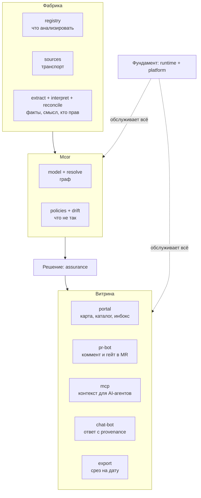

# Продуктовый взгляд на Archon

> Черновик. Этот документ отвечает на вопрос "что видит пользователь". 
> Как всё устроено внутри — читай в [`modules/README.md`](modules/README.md).

## Что такое Archon простыми словами

Представь, что у компании есть код десятков сервисов и документация к ним. Со временем код меняется, а документы забывают обновлять. В итоге документация врёт, а AI-агенты в IDE (Cursor, Copilot, Claude) галлюцинируют и ломают прод, потому что опираются на устаревший контекст.

**Archon — это облачная платформа (Managed SaaS), выступающая AI-native Source of Truth для всей архитектуры компании.** Она непрерывно сканирует код, строит точный граф связей (Knowledge Graph), выявляет расхождения (spec-drift) и доставляет проверенные архитектурные факты инженерам и AI-агентам через сетевые протоколы и автообновление документации прямо в репозитории.

## Ключевые каналы взаимодействия с сервисом

Внутри Archon работают 17 логических модулей («фабрика знаний»). Но пользователю и его инструментам не нужно знать их устройство. Archon поставляется как сервис из облака (Context-as-a-Service) с ключевыми интерфейсами взаимодействия:

### 1. MCP-сервер (Model Context Protocol) — для AI-агентов в IDE

Основной сетевой канал для AI-ассистентов (Cursor, Claude Desktop, Copilot). 
Когда агент пишет код или выполняет рефакторинг, он запрашивает у Archon структурированный контекст:
- Границы ответственности и зависимости текущего модуля (вверх и вниз).
- Точные схемы контрактов (OpenAPI, DTO, Kafka-топики).
- Архитектурные правила и инварианты (например, запрет ходить в обход шлюза).
- Известные проблемы и принятые риски.

Модель получает только сухие, нормализованные факты — экономия токенов до 80% и нулевые галлюцинации.

### 2. Портал (веб-интерфейс) — для архитекторов и лидов

Визуальный центр управления архитектурой в браузере:
- **Интерактивные C4-диаграммы:** наглядные схемы (Context, Container, Component, Data Flows), автоматически перерисовывающиеся по коду.
- **Мониторинг расхождений (Spec-Drift Monitor):** где документация разошлась с кодом, с точными пруфами из строк кода.
- **Knowledge Graph Explorer:** интерактивный граф связей между всеми продуктами и сервисами компании.
- **Assurance Inbox:** журнал архитектурных решений (подтвердить drift, принять технический долг, пометить ложное срабатывание).

### 3. Docs-as-Code Engine и Git Sync (PR-бот)

Двусторонний мост между облачным графом и Git-репозиториями:
- **Авто-актуализация доков:** Archon генерирует и обновляет в репозитории файлы `AGENTS.md`, `.archon/` и карточки сервисов через автоматические Pull Request'ы. Документы всегда соответствуют коду.
- **PR-бот и проверки:** при создании PR бот комментирует архитектурные изменения и предупреждает о нарушении зависимостей.

### 4. API (REST / GraphQL) — для автоматизации и CI/CD

Программный интерфейс для корпоративного конвейера:
- **CI/CD Quality Gates:** проверка архитектурных политик и блокировка мержа при критическом дрейфе.
- **Webhooks:** прием событий от VCS и отправка алертов о дрейфе во внешние системы.
- Доступ к графу и экспорт срезов архитектуры для регуляторов и аудита (JSON/PDF).

### 5. Чат-бот — для быстрых ответов в мессенджерах

Интерфейс для Slack, Mattermost, Telegram: быстрые ответы на вопросы инженеров («кто владелец сервиса?», «какие методы есть у API?») со ссылкой на репозиторий и точный провенанс из графа.

---

## Что происходит внутри: 5 блоков

Внутри 17 модулей сгруппированы в 5 блоков по принципу "насколько близко к пользователю":

| Блок | Что делает | Пользователь видит? |
| :--- | :--- | :--- |
| **Витрина** | Показывает результат и отдаёт контекст: портал, бот в Git, MCP-сервер, чат-бот, генератор артефактов экспорт | Да, только это |
| **Решение** | Следит за жизненным циклом каждой проблемы: обнаружена → исправлена / риск принят / ложная тревога | Видит статусы проблем |
| **Мозг** | Строит граф связей из кода и документов, ищет что не так | Нет, видит только следствия |
| **Фабрика** | Читает код, документы, разбирается в конфликтах между источниками | Нет |
| **Фундамент** | Очереди задач, права доступа, аудит, SSO (без этого не продать в enterprise) | Нет |

Есть два способа посмотреть на эти 17 модулей:
- **Блоками** (как выше) — удобно для разговора о продукте.
- **Слоями конвейера** — удобно для разговора об архитектуре (см. [`modules/README.md`](modules/README.md)).

Оба способа описывают одно и то же, просто с разных сторон.

## Диаграмма продукта (снизу вверх)

Читается снизу вверх: фабрика копает факты, мозг складывает их в граф и
проверяет, решение фиксирует вердикт человека, витрина показывает его там,
где удобно. Фундамент под всеми.

## Как это выглядит в реальной жизни

**Утро, архитектор:**
Открывает портал, видит 3 проблемы, которые система нашла ночью. Две исправляет сразу, одну помечает "мы знаем об этом, риск принят" — больше система её не показывает.

**День, разработчик:**
Создаёт PR с изменением кода. Бот пишет комментарий: "Ты поменял код, а документ `docs/payments.md` всё ещё описывает старое". Разработчик тут же правит документ в том же PR.

**В процессе работы, инженер и AI-агент в IDE:**
Разработчик пишет в Cursor: "Реализуй вызов сервиса биллинга". Cursor через MCP запрашивает Archon, получает точные DTO, адрес и архитектурные ограничения — код генерируется с первого раза без ошибок и выдуманных эндпоинтов.

**Вечер, тимлид:**
Пишет боту в Slack: "Кто трогал сервис `billing` за последний месяц?" — получает ответ со ссылками на коммиты и людей.

**Через квартал, для аудита:**
Нажимает "экспорт", получает PDF с полным снимком архитектуры на эту дату. Никаких ручных скриншотов.

## Что делаем сначала (MVP)

**MVP** — Minimum Viable Product, минимальная версия для первых пользователей.

Делаем:
- Портал, бот в Git и MCP-сервер для AI-агентов (чат-бот и экспорт — потом).
- Главную фичу: показываем, где документы не совпадают с кодом, с доказательствами, и генерируем актуальный контекст (`AGENTS.md`).
- Фабрику и мозг — ядро для анализа репозитория и построения графа.

## Роли и точки входа

| Роль | Основная точка входа | Что получает |
| :--- | :--- | :--- |
| Архитектор | портал + экспорт | карта, инбокс, срез на дату |
| Разработчик | pr-bot + чат | комментарий в MR, быстрые ответы |
| AI-агент (Cursor, Copilot) | MCP + AGENTS.md | проверенный контекст, контракты, инварианты |
| Тимлид/менеджмент | портал | зрелость, динамика дрейфа |
| Безопасность/аудит | экспорт + портал | пруфы, история решений |
| Новичок | портал + чат | онбординг по актуальному графу |

## Чем Archon НЕ является

Важно понимать границы:

- **Не фреймворк типа Backstage.** Пользователю не надо писать код, чтобы начать работать с Archon.
- **Не замена Confluence.** Archon работает только с архитектурной документацией (описания сервисов, схемы связей). Общие статьи, заметки, HR-политики — это не для нас.
- **Не просто "поиск по документам".** Чат-бот работает не как Google по файлам, а отвечает на основе графа связей, который система сама построила.
- **Не редактор диаграмм.** Диаграммы не рисуются руками, а генерируются из кода автоматически.
