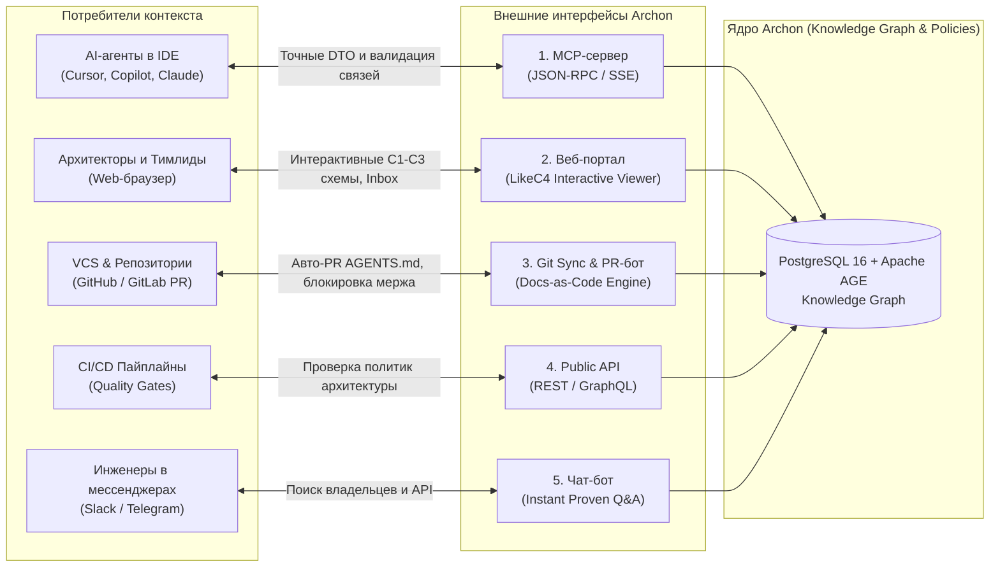
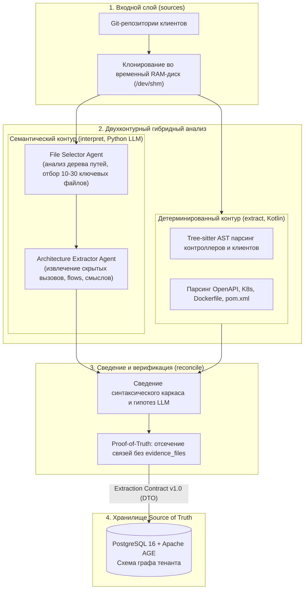
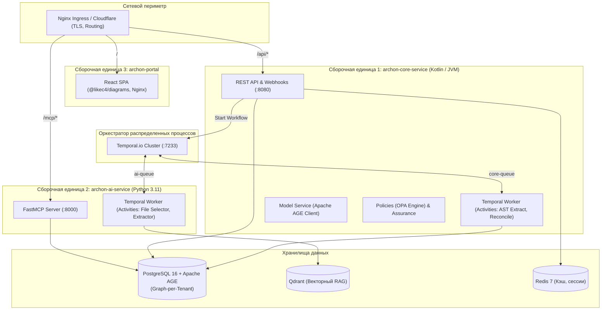

# Архитектурный кейс: Archon — AI-native Source of Truth & Enterprise Docs-as-Code Platform

> **Проект:** Archon (Managed SaaS & Context-as-a-Service)  
> **Роль:** Lead System Architect & Product Visionary (Денис `@ischademadda`)  
> **Команда:** Синдикат Team v.3.9 (4 инженера: Lead Architect, AI Scientist, Core Backend, DevOps/SRE + пул)  
> **Период:** 2026  
> **Статус:** Фаза 0 (Архитектурное проектирование, PoC и валидация) ➔ Фаза 1 (Core MVP)

---

## 1. Executive Summary (Краткий обзор проекта)

**Archon** — это облачная enterprise-платформа (Managed SaaS), выступающая **AI-native Source of Truth** для архитектуры распределенных систем и микросервисов компании. Миссия платформы — **Zero Drift**: непрерывная синхронизация архитектурной документации с реальным исходным кодом репозиториев и поставка проверенного контекста инженерам и AI-агентам разработки (Cursor, GitHub Copilot, Claude Code).

### Ключевая проблема индустрии
Внедрение генеративного AI в разработку (Agentic Development Life Cycle — ADLC) привело к 10-кратному ускорению написания кода. Однако традиционная документация (Confluence, Notion, устаревшие Wiki) отстает в реальном времени. В результате:
1. **AI-агенты галлюцинируют:** при генерации межсервисных вызовов и рефакторинге агенты опираются на устаревшие спецификации, создавая циклические зависимости и ломая продакшн.
2. **Архитектурный дрейф (Spec Drift):** реальная топология сервисов в коде расходится с проектной документацией уже через 2 недели после релиза.
3. **Высокая стоимость онбординга и аудита:** понимание последствий изменений (Blast Radius / Impact Analysis) требует ручного чтения сотен репозиториев.

### Решение Archon
Archon подключается к корпоративным репозиториям (GitHub / GitLab) за 2 минуты через SaaS App, автоматически извлекает синтаксические факты (детерминированный AST-анализ) и семантические бизнес-сценарии (двухфазный LLM-контур), формируя строгий мультитенантный граф знаний (Knowledge Graph). Граф непрерывно актуализируется и доставляется потребителям через **Model Context Protocol (MCP)**, интерактивные **C4-диаграммы (LikeC4)**, **Git Sync PR-ботов** и **CI/CD Quality Gates**.

---

## 2. Роль и зона ответственности (Lead Architect)

В роли ведущего системного архитектора Денис выполнил полный цикл проектирования платформы:
- **Product Vision & NFR:** сформулировал концепцию Zero Drift, 5 продуктовых каналов и нефункциональные требования к безопасности, производительности и надежности.
- **Модульная декомпозиция:** разработал архитектуру фабрики знаний из 17 логических модулей, организованных по принципу ортогональности и независимости жизненных циклов («модуль != сервис»).
- **Снятие архитектурных блокеров через ADR:** автор и драйвер ключевых архитектурных решений (ADR-0001 — ADR-0007), снявших все развилки до начала кодирования ядра.
- **R&D графового хранилища:** спроектировал и верифицировал модель мультитенантного графа на PostgreSQL 16 + Apache AGE с изоляцией Graph-per-Tenant (`ag_catalog`).
- **Проектирование конвейера Code-to-Architecture:** формализовал Extraction Contract v1.0, двухфазный пайплайн сбора фактов и устранения галлюцинаций через `evidence_files`.
- **Физическая топология SaaS:** упаковал 17 модулей в 3 сборочные единицы (`archon-core-service`, `archon-ai-service`, `archon-portal`) под оркестрацией Temporal Polyglot Workflows.
- **Инженерное лидерство:** выстроил Docs-as-Code процесс, чек-листы и правила работы для людей и AI-агентов (`AGENTS.md`), настроил трекер на 37 задач в GitHub Projects.

---

## 3. Архитектура витрины (5 интерфейсов взаимодействия)

Archon поставляется по модели **Context-as-a-Service**. Вся внутренняя сложность скрыта за 5 внешними точками входа:



1. **MCP-сервер (Model Context Protocol):**
   - Прямой сетевой шлюз для AI в IDE (Cursor, Claude Code).
   - Инструменты: `get_service_contract` (отдает валидную схему DTO без необходимости читать чужой код), `validate_dependency` (субсекундная проверка отсутствия циклов и нарушений слоев перед кодогенерацией).
   - Экономия токенов в окне контекста до 80%, исключение галлюцинаций.
2. **Веб-портал (React / LikeC4):**
   - Интерактивная навигация по масштабам системы: C1 (Системный контекст), C2 (Контейнеры / Сервисы), C3 (Компоненты).
   - Spec-Drift Monitor: экран с точными доказательствами расхождений между документацией и кодом со ссылками на строки.
   - Assurance Inbox: интерфейс принятия архитектурных решений тимлидами (принять технический долг, подтвердить drift, отклонить ложное срабатывание).
3. **Docs-as-Code Engine & Git Sync (PR-бот):**
   - Двусторонняя синхронизация: материализация актуальных графовых данных в репозитории через автоматические PR с файлами `AGENTS.md`, `.archon/` и карточками сервисов.
   - PR-бот комментирует Pull Request инженеров и блокирует мерж при нарушении архитектурных инвариантов.
4. **Public API (REST / GraphQL):**
   - Архитектурные Quality Gates для CI/CD гейтов (например, блокировка сборки при обнаружении незадокументированного публичного эндпоинта или циклической зависимости).
5. **Чат-бот (Slack / Telegram / Mattermost):**
   - Мгновенные инженерные ответы на естественном языке с обязательным провенансом (ссылками на конкретные коммиты и файлы репозитория).

---

## 4. Логическая архитектура фабрики (17 модулей в 5 блоках)

В соответствии с **ADR-0004** внутренняя фабрика декомпозирована на 17 ортогональных модулей, объединенных в 5 блоков:

```
┌─────────────────────────────────────────────────────────────────────────────┐
│ 1. ВИТРИНА (Showcase)                                                       │
│    [portal]      Веб-портал с LikeC4 диаграммами и инбоксом находок         │
│    [pr-bot]      Бот в Git: комментарии к PR, гейты, блокировки             │
│    [mcp]         Сервер Model Context Protocol для AI-агентов IDE           │
│    [chat-bot]    Бот в корпоративных мессенджерах                           │
│    [export]      Генератор артефактов (LikeC4 DSL, AGENTS.md, PDF-отчеты)   │
├─────────────────────────────────────────────────────────────────────────────┤
│ 2. РЕШЕНИЕ (Decision)                                                       │
│    [assurance]   Жизненный цикл находок, доверие, принятие компромиссов     │
├─────────────────────────────────────────────────────────────────────────────┤
│ 3. МОЗГ (Brain)                                                             │
│    [model]       Канонический граф знаний (Knowledge Graph)                 │
│    [resolve]     Склейка межрепозиторных сущностей (Cross-Repo Identity)    │
│    [policies]    Движок декларативных архитектурных инвариантов (OPA)       │
│    [drift]       Детектор расхождений: документация vs код                  │
├─────────────────────────────────────────────────────────────────────────────┤
│ 4. ФАБРИКА (Factory)                                                        │
│    [registry]    Реестр репозиториев, привязки команд и конфигурации        │
│    [sources]     Адаптеры источников (GitHub, GitLab, Bitbucket)            │
│    [extract]     Детерминированный AST-парсер (Tree-sitter, манифесты)      │
│    [interpret]   Семантический экстрактор на базе LLM (File Selector/Agent) │
│    [reconcile]   Сведение фактов, проверка evidence_files и confidence      │
├─────────────────────────────────────────────────────────────────────────────┤
│ 5. ФУНДАМЕНТ (Foundation)                                                   │
│    [runtime]     Оркестрация распределенных воркеров, очереди (Temporal)    │
│    [platform]    Multi-tenancy, SSO (Keycloak), RBAC, аудит, секреты        │
└─────────────────────────────────────────────────────────────────────────────┘
```

---

## 5. Сквозной контур извлечения: Code-to-Architecture

Ключевой алгоритмический контур платформы обеспечивает преобразование сырого исходного кода в верифицированный граф архитектуры без галлюцинаций:



### Принципы Zero Hallucinations:
1. **Строгая доказуемость (Proof-of-Truth):** каждая сущность, контракт или ребро зависимости в графе обязаны содержать массив `evidence_files` с указанием конкретных путей к файлам и номеров строк кода. Факты без доказательств отбрасываются.
2. **Двухфазная токеномика:** File Selector анализирует только плоское дерево путей репозитория (без чтения кода) и отбирает 10–30 файлов архитектурных границ, экономя более 90% токенов LLM.
3. **Extraction Contract v1.0:** формализованный JSON Schema контракт между этапами анализа и сохранением в БД, гарантирующий типобезопасность.

---

## 6. Физическая топология процессов (ADR-0007 / deployment.md)

В рамках **ADR-0007** все 17 логических модулей упакованы в **3 независимые сборочные единицы**, разворачиваемые в облачном Kubernetes-кластере:



### Ключевые инженерные решения топологии:
- **Temporal Polyglot Workflows:** Kotlin Workflow оркестрирует шаги: Activity 1 (Kotlin: клон в RAM + AST) ➔ Activity 2 (Python: LLM-извлечение) ➔ Activity 3 (Kotlin: Reconcile + запись в AGE). При сбое LLM Temporal автоматически ретраит только шаг 2 с экспоненциальным бэкоффом без перепарсинга AST.
- **Privacy-by-default:** код клиента клонируется в эфемерный том pod'а `emptyDir: { medium: "Memory" }` (RAM-диск). Сразу после AST-разбора выполняется принудительный `rm -rf`. Исходный код на постоянных дисках не сохраняется.
- **Минимализм Ingress:** отказ от отдельного тяжелого API Gateway на этапе MVP в пользу стандартного Nginx Ingress Controller.

---

## 7. Хранилище данных и R&D мультиарендности (ADR-0003)

Для хранения графа знаний было проведено исследование и стресс-тестирование связки **PostgreSQL 16 + расширение Apache AGE 1.5.0**:
- **Доказательство модели Graph-per-Tenant:** в Apache AGE каждый граф физически проецируется в отдельную схему PostgreSQL (`pg_namespace`).
- **Стресс-тестирование:** подтверждено создание, наполнение и удаление 50 изолированных графов тенантов без деградации производительности ядра СУБД.
- **Производительность:** обход графа на глубину до 4 связей (расчет Impact Analysis и выявление циклов) занимает **< 15 мс**, что полностью укладывается в NFR (< 100 мс).
- **Смешанная модель:** реляционные сущности (аккаунты, пользователи, подписки, аудит) хранятся в стандартных таблицах PostgreSQL с `tenant_id`, а топология сервисов — в графе `tenant_<id>` через запросы openCypher.

---

## 8. Архитектурные решения (Реестр ADR)

Все стратегические развилки проекта зафиксированы в стандартизированных Architecture Decision Records (формат MADR):

| ADR | Название | Статус | Суть принятого решения |
|:---:|:---|:---:|:---|
| **[ADR-0001](docs/adr/0001-docs-as-code.md)** | Docs-as-Code подход | Accepted | Вся проектная документация ведется рядом с кодом в Markdown, версионируется в Git и синхронизируется через PR. |
| **[ADR-0002](docs/adr/0002-archmap-fate.md)** | Концептуальное наследие archmap | Accepted | Списание устаревшего монолитного прототипа archmap (Python/Neo4j), перенос продуктовой ценности в веху Code-to-Architecture. Закрыт блокер **OQ-1**. |
| **[ADR-0003](docs/adr/0003-source-of-truth-and-tenant-isolation.md)** | Хранилище Source of Truth и изоляция тенантов | Accepted | Выбор PostgreSQL 16 + Apache AGE. Мультиарендность по модели Graph-per-Tenant (`ag_catalog`). Закрыты блокеры **OQ-2** и **OQ-5**. |
| **[ADR-0004](docs/adr/0004-module-decomposition-revision-1.md)** | Модульная декомпозиция (Ревизия 1) | Accepted | Декомпозиция системы на 17 ортогональных модулей, зафиксирован принцип "модуль != сервис", разделение контуров извлечения (`extract`, `interpret`, `reconcile`). |
| **[ADR-0005](docs/adr/0005-product-scope-and-delivery-model.md)** | Граница скоупа продукта | Accepted | Archon позиционируется как интеллектуальный слой знаний над существующими инструментами компании, а не их замена. Закрыт **OQ-10**. |
| **[ADR-0006](docs/adr/0006-saas-delivery-model-and-ai-native-source-of-truth.md)** | Managed SaaS и AI-native Source of Truth | Accepted | Переход к управляемому облачному сервису (Context-as-a-Service), внедрение MCP Server, Git Sync и автогенерации `AGENTS.md`. Закрыты **OQ-18**, **OQ-19**. |
| **[ADR-0007](docs/adr/0007-saas-process-topology-and-packaging.md)** | Физическая топология процессов SaaS | Accepted | Упаковка 17 модулей в 3 сборочные единицы под оркестрацией Temporal Polyglot Workflows, изоляция в RAM-диске (Privacy-by-default). Закрыт блокер **OQ-8**. |

---

## 9. Технологический стек платформы

| Слой системы | Технологии | Назначение и обоснование |
|:---|:---|:---|
| **Core Backend** | **Kotlin / JVM 21**, Spring Boot 3, Micronaut | Ядро платформы, REST API, парсинг AST, работа с СУБД. Выбран за строгую типизацию, производительность и развитый Temporal Java SDK. |
| **AI / R&D Engine** | **Python 3.11+**, FastAPI, FastMCP, LangChain, DSPy | Семантический анализ, промпт-инжиниринг, интеграция с OpenAI / Anthropic / vLLM, RAG. |
| **Frontend / Visual** | **TypeScript, React, Vite**, Tailwind CSS, `@likec4/diagrams` | Интерактивные C4-диаграммы, мониторинг spec-drift, каталог микросервисов. |
| **Knowledge Graph & DB**| **PostgreSQL 16 + Apache AGE 1.5.0** | Единая база для реляционных данных тенантов и графовой топологии (openCypher). |
| **Векторная БД** | **Qdrant** | Быстрый векторный движок на Rust для RAG по фрагментам документации и сигнатурам. |
| **Кэш и шина** | **Redis 7, NATS JetStream** | Кэш горячих срезов графа, rate-limiting, легковесный брокер событий. |
| **Оркестрация** | **Temporal.io** | Управление распределенными полиглотными пайплайнами анализа с гарантированными сагами и ретраями. |
| **DevOps & Deploy** | **Docker, Docker Compose, Kubernetes (K8s)** | Контейнеризация, эфемерные RAM-песочницы (`/dev/shm`), CI/CD пайплайны GitHub Actions. |

---

## 10. Эталонный датасет (Golden Dataset: 6 сервисов)

Для верификации правил и валидации MCP-сервера спроектирован эталонный ландшафт E-Commerce домена:
- **6 сервисов:** `order-service` (Kotlin), `billing-service` (Java), `inventory-service` (Go), `delivery-service` (TypeScript), `notification-service` (Python), `auth-service` (Java).
- **Контракты:** REST (`POST /invoices`, `GET /orders/{id}`, `GET /availability`, `POST /deliveries`) и Kafka (`order.paid`).
- **Заложенные архитектурные дефекты для тестирования:**
  1. *Прямой цикл:* `order-service` ↔ `billing-service`.
  2. *Транзитивный цикл длины 3:* `order` ➔ `delivery` ➔ `billing` ➔ `order`.
  3. *Архитектурный дрейф:* незадокументированный эндпоинт `DELETE /api/v1/orders/{id}/force`.
  4. *Shared Database:* прямой доступ `order-service` и `billing-service` в чужую БД `auth-db`.
  5. *Layering Violation:* попытка инфраструктурного сервиса (`auth-service`) вызвать бизнес-сервис (`delivery-service`).

---

## 11. Инженерное лидерство и операционные результаты

1. **Разблокировка разработки ядра:** 100% архитектурных блокеров (OQ-1, OQ-2, OQ-5, OQ-8) закрыты аргументированными ADR до начала масштабного кодирования.
2. **Четкий бэклог команды:** доска GitHub Projects приведена к прозрачной структуре (37 задач, вехи Фаза 0 и Фаза 1, оценка размеров XS-L, привязка исполнителей и критериев DoD).
3. **Автоматизация управления:** разработан CLI-скрипт `scripts/tasks.py` для мгновенной фильтрации задач команды (`--ready`, `--assignee`, `--p1`).
4. **Инструкции для AI-агентов (`AGENTS.md`):** формализован регламент парного программирования человека и AI в репозитории (правила веток, коммитов, запрет CJK-артефактов, проверка ссылок).
5. **Экономическая валидация:** проведено исследование рыночной ниши и подготовлена тарифная сетка Managed SaaS (Free, Team, Enterprise).

---

## 12. Резюме для интервью и портфолио

> *«В проекте Archon я выступил ведущим архитектором системы нового поколения — AI-native Source of Truth платформы. Мне удалось решить фундаментальное противоречие современной разработки: ускорение написания кода AI-агентами неизбежно разрушает целостность архитектуры. Мы спроектировали систему, которая превращает архитектуру из пассивных документов в Confluence в активный, исполняемый контекстный слой компании. Архитектурно мы упаковали 17 модулей в 3 полиглотных сервиса под управлением Temporal, доказали эффективность PostgreSQL + Apache AGE для enterprise multi-tenancy и предоставили AI-агентам субсекундный протокол MCP для валидации зависимостей прямо в IDE. Вся архитектура спроектирована по стандартам Docs-as-Code и зафиксирована в 7 ADR без единого неразрешенного блокера».*
