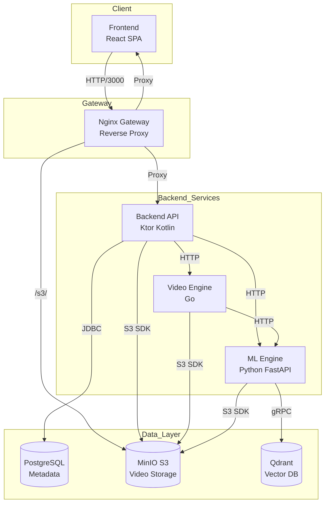
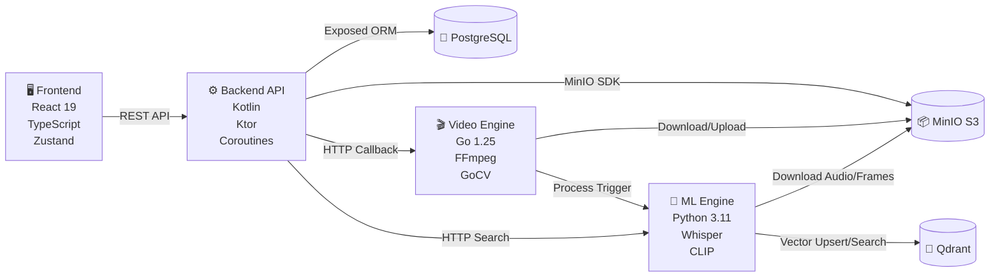
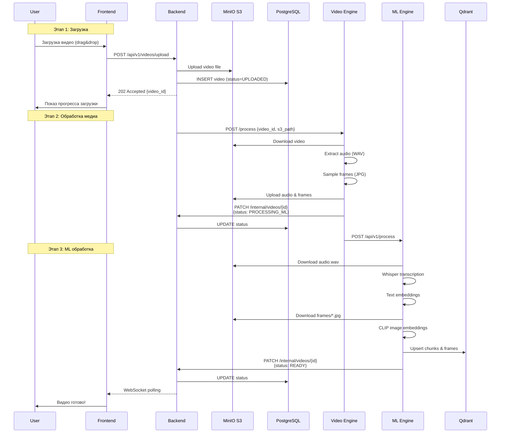
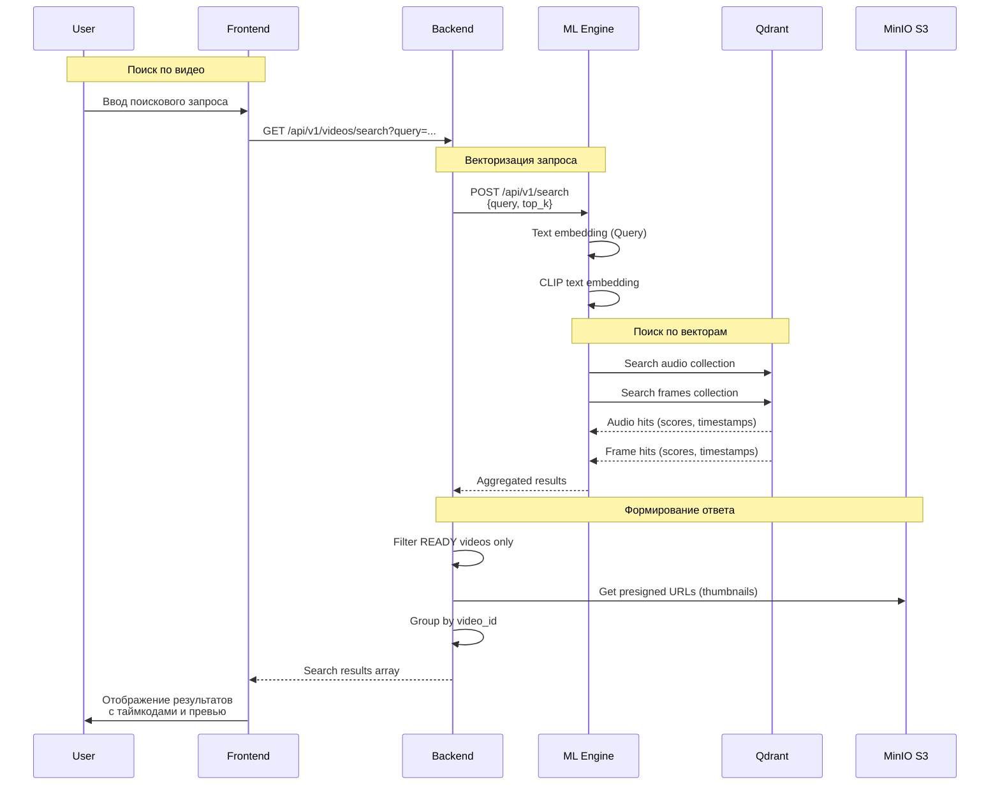
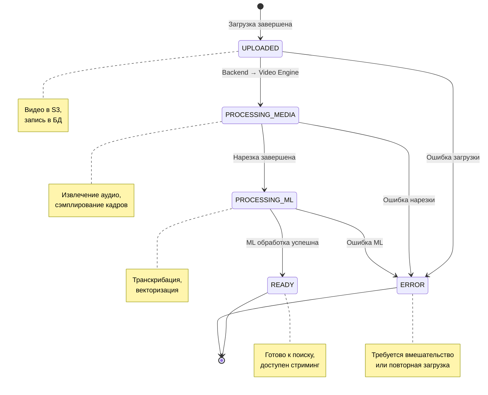

# OmniSearch Engine

[](https://github.com/Team-v3-9-a/OmniSearch-Engine/actions)
[]()

**OmniSearch Engine** — это on-premise мультимодальная RAG-система (Retrieval-Augmented Generation) для семантического поиска по видеоархивам. Система позволяет загружать видеофайлы, автоматически обрабатывать их (транскрибация аудио, извлечение кадров, генерация векторных эмбеддингов) и выполнять поиск по контенту с помощью естественного языка.

## 🎯 Возможности

- **Семантический поиск** — поиск по смыслу запроса, а не по ключевым словам
- **Мультимодальность** — анализ аудио (транскрибация) и визуального контента (CLIP embeddings)
- **Асинхронный пайплайн обработки** — загрузка, нарезка кадров, транскрибация, векторизация
- **Микросервисная архитектура** — разделение I/O и compute-задач
- **Real-time статус** — отслеживание прогресса обработки видео
- **Персональная библиотека** — страница "Мои видео" со всеми загруженными файлами
- **Пресigned URL** — безопасная потоковая передача видео из S3

## 🏗 Архитектура

### Общая схема системы



### Компонентная диаграмма



### Пайплайн загрузки видео



### Пайплайн поиска



### Диаграмма состояний видео



## 🛠 Технологический стек

| Компонент | Технологии |
|-----------|------------|
| **Frontend** | React 19, TypeScript, Vite, React Router, Zustand, React Query, Axios |
| **Backend (Control Plane)** | Kotlin, Ktor, Exposed ORM, HikariCP, Koin DI, Coroutines |
| **Video Engine** | Go 1.25, GoCV (OpenCV), FFmpeg, MinIO SDK |
| **ML Engine** | Python 3.11, PyTorch, Whisper, CLIP, Sentence Transformers, FastAPI |
| **Базы данных** | PostgreSQL 15 (метаданные), Qdrant (векторы) |
| **Хранилище** | MinIO (S3-совместимое) |
| **Инфраструктура** | Docker, Docker Compose, Nginx (gateway), GitHub Actions |
| **Мониторинг** | Health checks, логирование, graceful shutdown |

## 📁 Структура репозитория

```
OmniSearch-Engine/
├── backend/                    # Ktor Control Plane (Kotlin)
│   ├── src/main/kotlin/com/v39a/omni/
│   │   ├── core/               # Утилиты, исключения, расширения
│   │   ├── feature/video/      # Видео-домен
│   │   │   ├── api/            # REST API (routes, DTOs)
│   │   │   ├── domain/         # Доменные модели, use cases, репозитории
│   │   │   └── infrastructure/ # Релизации: PostgreSQL, MinIO, HTTP-клиенты
│   │   └── plugins/            # Ktor плагины (DB, CORS, DI, Security)
│   ├── build.gradle.kts
│   └── src/main/resources/
│       └── application.yaml
│
├── frontend/                   # React SPA (TypeScript)
│   ├── src/
│   │   ├── api/                # API клиент (Axios)
│   │   ├── components/         # UI компоненты
│   │   │   ├── Pages/          # Страницы: HomePage, SearchResultsPage, MyVideosPage, VideoPage
│   │   │   ├── VideoCard/      # Карточка видео с прогрессом
│   │   │   ├── Search/         # Поисковая строка
│   │   │   └── StatusLabel/    # Индикатор статуса
│   │   ├── hooks/              # Кастомные хуки (useUploadVideo, useVideoPooling)
│   │   ├── router/             # React Router конфигурация
│   │   ├── store/              # Zustand store (загрузки)
│   │   ├── types/              # TypeScript типы
│   │   └── utils/              # Утилиты
│   ├── package.json
│   └── vite.config.ts
│
├── video-engine/               # Go микросервис для обработки медиа
│   ├── cmd/video-engine/       # Точка входа
│   ├── internal/
│   │   ├── api/                # HTTP сервер (process, health)
│   │   ├── audio/              # Извлечение аудио
│   │   ├── video/              # Сэмплирование кадров
│   │   ├── ml/                 # Клиент ML Engine
│   │   ├── s3/                 # MinIO клиент
│   │   └── pipeline/           # Пайплайн обработки
│   ├── go.mod
│   └── Dockerfile
│
├── ml-engine/                  # Python микросервис для ML
│   ├── app/
│   │   ├── api/v1/routes.py    # FastAPI роуты (process, search)
│   │   ├── models/schemas.py   # Pydantic схемы
│   │   ├── services/
│   │   │   ├── inference.py    # Whisper, CLIP, Sentence Transformers
│   │   │   ├── vector_store.py # Qdrant клиент
│   │   │   └── s3_service.py   # MinIO клиент
│   │   └── core/dependencies.py
│   ├── requirements.txt
│   └── Dockerfile
│
├── nginx/
│   └── gateway.conf            # Nginx конфигурация (reverse proxy)
│
├── docs/
│   └── api/openapi.yaml        # OpenAPI 3.0 спецификация
│
├── .github/workflows/
│   ├── ci-pipeline.yml         # CI: build & lint всех сервисов
│   ├── deploy-dev.yml          # CD: deploy на dev
│   └── deploy-prod.yml         # CD: deploy на prod
│
├── docker-compose.yml          # Основная compose-файл
├── docker-compose.dev.yml      # Dev окружение
├── docker-compose.prod.yml     # Prod окружение
├── .env.example                # Шаблон переменных окружения
└── README.md
```

## 🚀 Быстрый старт

### Требования

- **Docker** & **Docker Compose** (версия 2.0+)
- **NVIDIA GPU** (опционально, для ML Engine с CUDA)
- Минимум **8 GB RAM** (рекомендуется 16 GB)
- Минимум **50 GB** свободного места на диске

### 1. Клонирование репозитория

```bash
git clone https://github.com/Team-v3-9-a/OmniSearch-Engine.git
cd OmniSearch-Engine
```

### 2. Настройка переменных окружения

```bash
cp .env.example .env
```

Отредактируйте `.env` файл:

```bash
# ---- API Security & Routing ----
INTERNAL_API_SECRET=your_secure_secret_token_here
API_EXTERNAL_URL=http://localhost:3000
CORS_ALLOWED_ORIGINS=http://localhost:3000

# ---- PostgreSQL ----
DB_USER=admin
DB_PASSWORD=changeme
DB_NAME=videosense

# ---- MinIO (S3) ----
S3_ACCESS_KEY=minioadmin
S3_SECRET_KEY=changeme
S3_BUCKET=videos

# ---- Shared Media Path ----
SHARED_MEDIA_PATH=/app/shared_media
```

> ⚠️ **Важно**: Измените пароли и секреты перед запуском в production!

### 3. Запуск через Docker Compose

```bash
docker compose up --build
```

Сервисы будут доступны по адресам:

| Сервис | URL | Описание |
|--------|-----|----------|
| **Frontend** | http://localhost:3000 | Веб-интерфейс |
| **Backend API** | http://localhost:3000/api/v1 | REST API |
| **MinIO Console** | http://localhost:9001 | Админка S3 (login: `minioadmin`) |
| **Qdrant Dashboard** | http://localhost:6333/dashboard | Векторная БД |
| **Video Engine** | http://localhost:8081/health | Health check |
| **ML Engine** | http://localhost:8000/health | Health check |

### 4. Проверка статуса

```bash
docker compose ps
```

Все сервисы должны иметь статус `healthy`.

## 📖 API Reference

### Основные эндпоинты

#### Загрузка видео

```http
POST /api/v1/videos/upload
Content-Type: multipart/form-data

file: <video.mp4>
```

**Ответ (202 Accepted):**
```json
{
  "video_id": "uuid",
  "message": "Video uploaded successfully. Processing started."
}
```

#### Поиск видео

```http
GET /api/v1/videos/search?query=как%20работает%20система
```

**Ответ (200 OK):**
```json
[
  {
    "video_id": "uuid",
    "title": "Презентация продукта",
    "thumbnail_url": "http://localhost:3000/s3/videos/media/.../frame_001.jpg",
    "duration": 120,
    "score": 0.89,
    "segments": [
      {
        "text_snippet": "...система использует векторный поиск...",
        "start_time": 45.5,
        "end_time": 52.3
      }
    ]
  }
]
```

#### Получение списка видео

```http
GET /api/v1/videos
```

#### Стриминг видео

```http
GET /api/v1/videos/{id}/stream
```

**Ответ:**
```json
{
  "url": "http://localhost:3000/s3/videos/media/..."
}
```

### Внутренние эндпоинты (Internal API)

Эти эндпоинты используются микросервисами для взаимодействия. Требуют заголовок `X-Internal-Secret`.

#### Обновление статуса видео (Video Engine → Backend)

```http
PATCH /api/v1/internal/videos/{id}
X-Internal-Secret: your_secret

{
  "status": "PROCESSING_ML",
  "durationSeconds": 180,
  "thumbnailPath": "media/uuid/thumbnail.jpg",
  "fps": 30.0,
  "resolution": "1920x1080"
}
```

#### Запуск обработки (Backend → Video Engine)

```http
POST http://video-engine:8081/process

{
  "video_id": "uuid",
  "s3_path": "videos/filename.mp4"
}
```

#### ML обработка (Video Engine → ML Engine)

```http
POST http://ml-engine:8000/api/v1/process

{
  "video_id": "uuid",
  "bucket_name": "videos",
  "audio_key": "media/uuid/audio.wav",
  "frames_prefix": "media/uuid/frames/"
}
```

#### ML поиск (Backend → ML Engine)

```http
POST http://ml-engine:8000/api/v1/search

{
  "query": "поисковый запрос",
  "top_k": 10
}
```

## 🎨 Frontend

### Страницы

1. **Home Page** (`/`)
   - Поисковая строка
   - Кнопка загрузки видео
   - Drag-and-drop зона
   - Уведомления о начале загрузки

2. **Search Results Page** (`/search?query=...`)
   - Результаты поиска с релевантностью
   - Таймкоды и текстовые сниппеты
   - Превью кадров

3. **My Videos Page** (`/my-videos`)
   - Список всех загруженных видео
   - Статусы: `UPLOADING`, `UPLOADED`, `PROCESSING_MEDIA`, `PROCESSING_ML`, `READY`, `ERROR`
   - Прогресс-бары загрузки и обработки
   - Разделение на "В процессе" и "Завершенные"

4. **Video Page** (`/video/:id`)
   - Видеоплеер
   - Метаданные видео
   - Детали обработки

### Компоненты

- `VideoCard` — карточка видео с превью и статусом
- `StatusLabel` — цветовой индикатор статуса
- `UploadProgress` — прогресс-бар загрузки
- `Search` — поисковая строка с автокомплитом
- `Button` — стилизованная кнопка
- `Header` — навигационная панель

## 🔧 Разработка

### Локальная разработка без Docker

#### Backend (Kotlin)

```bash
cd backend
./gradlew buildFatJar
java -jar build/libs/backend-all.jar
```

Требования:
- JDK 21
- PostgreSQL (локально или в Docker)
- MinIO (локально или в Docker)

#### Frontend (React)

```bash
cd frontend
npm install
npm run dev
```

Требования:
- Node.js 20+
- Backend API (запускается отдельно)

#### Video Engine (Go)

```bash
cd video-engine
go build -o video-engine ./cmd/video-engine
./video-engine
```

Требования:
- Go 1.21+
- GCC
- OpenCV 4.x

#### ML Engine (Python)

```bash
cd ml-engine
pip install -r requirements.txt
uvicorn app.main:app --reload --host 0.0.0.0 --port 8000
```

Требования:
- Python 3.10+
- CUDA 12.x (опционально, для GPU)
- Модели загружаются автоматически при первом запуске

### Тестирование

#### Backend

```bash
cd backend
./gradlew test
```

#### Frontend

```bash
cd frontend
npm run lint
npm run build
```

#### Video Engine

```bash
cd video-engine
go test ./...
```

#### ML Engine

```bash
cd ml-engine
ruff check .
pytest
```

### CI/CD

При пуше в ветки `main` или `preprod` автоматически запускается CI пайплайн:

1. ✅ **Frontend** — `npm install && npm run build`
2. ✅ **Backend** — `./gradlew buildFatJar`
3. ✅ **Video Engine** — `go build` (пропускается в CI из-за OpenCV)
4. ✅ **ML Engine** — `ruff check`
5. ✅ **Docker** — `docker buildx bake` (с кэшированием через GitHub Actions Cache)

## 📊 Мониторинг и логи

### Health Checks

Все сервисы имеют endpoints для проверки здоровья:

- Backend: `GET http://localhost:8080/api/v1/videos/search`
- Frontend: `GET http://localhost:80/`
- Video Engine: `GET http://localhost:8081/health`
- ML Engine: `GET http://localhost:8000/health`
- PostgreSQL: `pg_isready -U admin -d videosense`
- MinIO: `GET http://localhost:9000/minio/health/live`
- Qdrant: TCP port 6333

### Логирование

Логи пишутся в stdout каждого контейнера. Для просмотра:

```bash
docker compose logs -f backend
docker compose logs -f video-engine
docker compose logs -f ml-engine
```

## 🔐 Безопасность

### Internal API Secret

Для защиты внутренних эндпоинтов используется заголовок `X-Internal-Secret`. Значение задается в `.env` файле и должно быть одинаковым для всех сервисов.

### CORS

CORS настроен через переменную `CORS_ALLOWED_ORIGINS`. По умолчанию разрешен только `http://localhost:3000`.

### S3 Bucket Policy

Bucket `videos` имеет политику public-read только для объектов в префиксе `media/*`, что позволяет отдавать превью и видео через presigned URLs.

## 📈 Производительность

### Таймауты и лимиты

- Максимальный размер файла: **500 MB** (настраивается в `nginx/gateway.conf`)
- Таймаут проксирования: **300s** (для загрузки и обработки)
- Pool connections PostgreSQL: **15** (настраивается в `application.yaml`)
- HNSW индекс Qdrant: оптимизирован для p95 < 500ms

### Масштабирование

- **Backend** — stateless, можно масштабировать горизонтально
- **Video Engine** — stateless, можно запускать несколько инстансов
- **ML Engine** — compute-bound, рекомендуется 1 инстанс на GPU
- **PostgreSQL** — master-slave репликация (требует дополнительной настройки)
- **Qdrant** — кластеризация (требует дополнительной настройки)
- **MinIO** — распределенный режим (требует 4+ нод)

## 🐛 Известные ограничения

1. **Обработка больших видео** — видео > 500 MB требуют увеличения `client_max_body_size` в nginx
2. **GPU требования** — ML Engine без GPU работает медленно (транскрибация ~1x realtime)
3. **Дисковое пространство** — требуется ~5 GB на 1 час видео (оригинал + аудио + кадры)
4. **Первый запуск** — загрузка ML моделей может занять 10-15 минут

## 📝 Changelog

### Версия 0.2.0 (MVP Release)

**Добавлено:**
- ✅ Полный пайплайн загрузки и обработки видео
- ✅ Семантический поиск по аудио и кадрам
- ✅ Страница "Мои видео" с прогрессом обработки
- ✅ Страница результатов поиска с таймкодами
- ✅ Video Engine микросервис на Go
- ✅ ML Engine с Whisper и CLIP
- ✅ Docker Compose для dev/prod окружений
- ✅ GitHub Actions CI/CD пайплайн
- ✅ Nginx gateway с маршрутизацией

**Исправлено:**
- CORS ошибки и кэширование DNS в nginx
- Обработка ошибок в update status API
- Исправление bucket name: `video` → `videos`
- Множественные фиксы моков и endpoint'ов

### Соглашения по коммитам

- `feat:` — новая функциональность
- `fix:` — исправление багов
- `docs:` — изменения в документации
- `style:` — форматирование, отступы
- `refactor:` — рефакторинг кода
- `test:` — добавление тестов
- `chore:` — изменения в сборке, зависимостях


